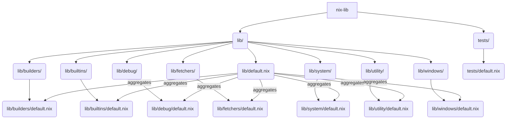

# nix-lib

`nix-lib` is a collection of Nix utility functions and modules designed to streamline Nix-based development. It provides a structured approach to common tasks, making Nix expressions more organized and reusable.

## Project Structure

The project is organized into a `lib/` directory, which contains various modules, each with a `default.nix` file. This structure allows for logical grouping of related functions and makes it easy to import specific utilities into your Nix projects.

```
.nix-lib/
├───flake.nix
├───flake.lock
├───LICENSE
├───README.md
├───lib/
│   ├───default.nix
│   ├───builders/             # Functions for building derivations
│   │   └───default.nix
│   ├───builtins/             # Wrappers or extensions for Nix built-in functions
│   │   └───default.nix
│   ├───debug/                # Utilities for debugging Nix expressions
│   │   └───default.nix
│   ├───fetchers/             # Functions for fetching external resources
│   │   ├───default.nix
│   │   └───fetchurlBinary-builder.sh
│   ├───system/               # System-related utilities (e.g., path manipulation)
│   │   └───default.nix
│   ├───utility/              # General-purpose utility functions
│   │   └───default.nix
│   └───windows/              # Windows-specific Nix utilities
│       └───default.nix
└───tests/
    └───default.nix
```

### `lib/default.nix`

This file serves as the main entry point for the `nix-lib`'s utility functions. It aggregates and exposes the modules defined in the subdirectories, making them accessible through a single import.

## UML Diagram of Project Structure



## Nix Techniques Used

`nix-lib` leverages several core Nix features and best practices:

-   **Nix Flakes**: The project uses `flake.nix` for defining its inputs and outputs, ensuring reproducible and hermetic builds. Flakes simplify dependency management and make it easier to consume `nix-lib` in other Nix projects.

-   **Module System**: The `lib/` directory and its subdirectories demonstrate a modular approach to organizing Nix code. Each `default.nix` file within a subdirectory acts as a module, exporting a set of functions or attributes. This promotes code reusability and maintainability.

-   **`callPackage`**: This function is likely used within `default.nix` files to automatically pass dependencies to functions defined in separate files, reducing boilerplate and improving readability.

-   **Derivations**: The `builders/` and `fetchers/` modules exemplify the creation and manipulation of Nix derivations, which are the fundamental units of reproducible builds in Nix.

-   **Overlays**: While not explicitly shown in the file structure, `nix-lib`'s design makes it suitable for use with Nix overlays, allowing users to extend or modify the behavior of existing Nix packages and modules.